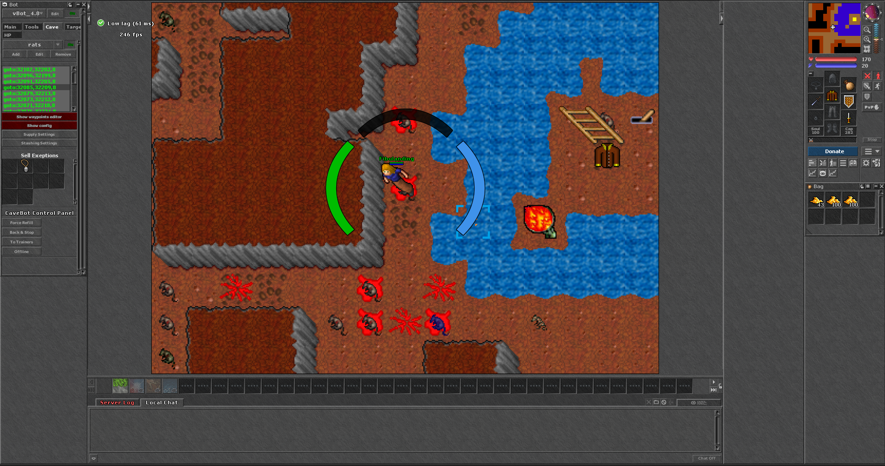
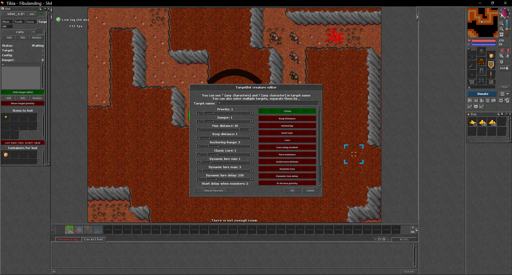
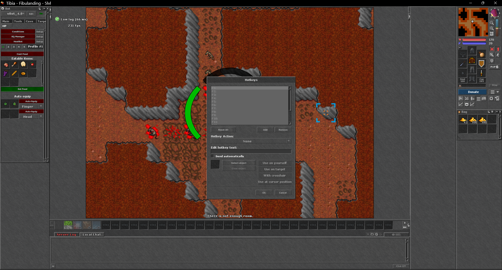

<h1>🗡️ Project Fibula — Client</h1>

A custom Tibia **7.72** client for **Project Fibula** (`world.fibula.app`).

> Built on **[OTClient Redemption](https://github.com/opentibiabr/otclient)** by **opentibiabr** — full credit and thanks to the OTClient team and contributors.
> This is a fork configured and maintained for Project Fibula. Licensed under MIT (see [LICENSE](LICENSE)).

---

## ⬇️ Download & Play — plug and play

1. Download the latest **[ProjectFibula-Client.zip](https://github.com/edyxo/projectfibulaclient/releases/latest)**
2. **Extract** it anywhere
3. Run **`otclient.exe`**
4. Log in with your Fibula account and play 🎮

That's it — **no install, no setup**. The server, protocol (7.72), sprites, world map and bot are all pre-configured and bundled. Everything just works out of the box.

---

## ☕ Support Project Fibula

> ### Enjoying the client? Consider donating to the creator.
>
> Every donation helps keep **Project Fibula** alive and improving. Thank you! 🙏

Scan a QR with your camera, or hit the **Donate** button in-game.

  
  &nbsp;&nbsp;&nbsp;
  

  <b>💳 MercadoPago</b> — <a href="https://link.mercadopago.com.mx/edyxo">link.mercadopago.com.mx/edyxo</a>
  &nbsp;&nbsp;•&nbsp;&nbsp;
  <b>₿ Binance</b>

---

## 📸 Screenshots

   
  <em>CaveBot hunting with the pre-explored world minimap</em>

  
  

  <em>TargetBot creature editor&nbsp;&nbsp;•&nbsp;&nbsp;HealBot, auto-eat &amp; auto-equip</em>

---

## ✨ Features

- Pre-configured for **`world.fibula.app:7171`** (protocol **7.72**)
- Full **vBot** suite: CaveBot, TargetBot, HealBot, auto-eat, auto-equip, looting
- **World minimap** ships pre-explored
- In-game **Donate** button + Binance QR
- Classic 7.72 look & feel

## 🛠️ Built with

- **[OTClient Redemption](https://github.com/opentibiabr/otclient)** (opentibiabr) — engine & framework
- Lua-scripted UI and game modules

## 📜 License

MIT — see [LICENSE](LICENSE). OTClient and its framework are © their respective authors;
see the license and `AUTHORS` for full attribution.
